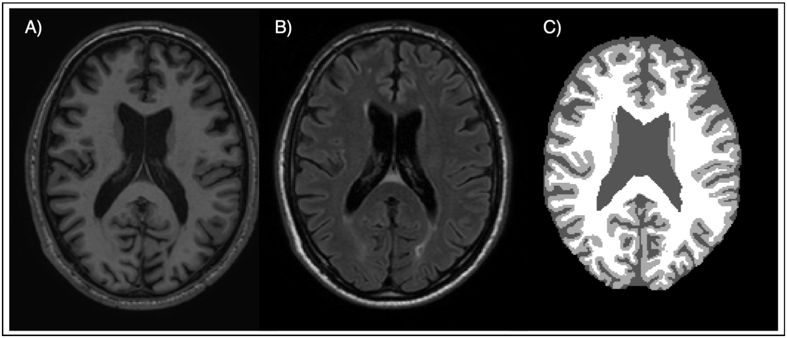

# Brain tissue segmentation using Expectation Maximization (EM) algorithm for Gaussian Mixture Models (GMM)
**Author:** Xavier Beltran Urbano and Frederik Hartmann

[Link to the Manuscript](https://xavibeltranurbano.github.io/assets/pdfs/EM_GMM.pdf)

This repository contains the implementation and results of a novel approach to brain tissue segmentation, combining the Expectation Maximization (EM) algorithm with Gaussian Mixture Models (GMM). Developed at the University of Girona as part of the Erasmus Mundus Joint Master Degree in Medical Imaging and Applications (MAIA), this method aims to enhance the accuracy of medical diagnoses and treatment planning for neurological conditions.

## Dataset

The segmentation process was conducted using a multimodal dataset comprising 5 MRI images, each with the following modalities:

- T1-weighted (T1)
- FLAIR-weighted (FLAIR)
- Ground Truth (GT)

  
   
  <em>Fig.1. Example of the different modalities of the dataset. A) T1 B) FLAIR C) GT</em>

## Methodology

Our approach utilizes the EM algorithm in two primary steps:

1. **Expectation Step**: Here, we assign a membership weight to each voxel, indicating the likelihood of it belonging to a particular tissue cluster.
2. **Maximization Step**: In this step, we update the parameters of our Gaussian models — means, covariances, and mixture weights — based on the current membership assignments.

The model initializes with either random parameters or using KMeans clustering for a more informed starting point. The iterative process of expectation and maximization continues until convergence is achieved, indicated by the log-likelihood reaching a plateau.

## Results

The algorithm's effectiveness was quantitatively evaluated using the Dice Score (DSC), a metric that computes the similarity between predicted and ground truth segmentations. Tables 1 and 2 present the algorithm's performance metrics alongside comparisons with other segmentation tools. 

  <strong>Table 1: Evaluation results of the Expectation Maximization Algorithm on the test set</strong>

| Initialization | Modalities | GM [DSC]            | WM [DSC]            | CSF [DSC]           | Iterations       | Time [s]          |
|----------------|------------|---------------------|---------------------|---------------------|------------------|-------------------|
| KMeans         | T1         | 0.8457 ± 0.0436     | 0.8015 ± 0.0300     | 0.8120 ± 0.0251     | 116 ± 4          | **24.36 ± 1.28**  |
| KMeans         | T1+FLAIR   | 0.8457 ± 0.0436     | **0.8017 ± 0.0304** | **0.8129 ± 0.0249** | **110 ± 17**     | 51.48 ± 8.10      |
| Random         | T1         | 0.8025 ± 0.0819     | 0.7284 ± 0.1383     | 0.7860 ± 0.0670     | 346 ± 108        | 65.87 ± 18.42     |
| Random         | T1+FLAIR   | **0.8468 ± 0.0450** | 0.7978 ± 0.0233     | 0.8082 ± 0.0278     | 333 ± 117        | 147.71 ± 51.16    |

  <strong>Table 2: Evaluation results of KMeans and SPM</strong>

| Method   | Initialization | Modalities | GM [DSC]         | WM [DSC]         | CSF [DSC]        | Time [s]         |
|----------|----------------|------------|------------------|------------------|------------------|------------------|
| K-means  | K-means ++     | T1         | 0.8222 ± 0.0356  | 0.7464 ± 0.0338  | 0.8542 ± 0.0078  | 3.57 ± 0.12      |
| K-means  | K-means ++     | T1+FLAIR   | **0.8243 ± 0.0357** | **0.7500 ± 0.0315** | **0.8560 ± 0.0071** | **3.61 ± 0.19**  |
| SPM      | -              | T1         | **0.75 ± 0.03**  | **0.81 ± 0.03**  | **0.76 ± 0.02**  | -                |

## Conclusion

In conclusion, the application of the Expectation Maximization algorithm with Gaussian Mixture Models has proven to be an effective strategy for the segmentation of brain tissues in MRI images. Our methodology not only aligns with the stringent requirements of medical image processing but also showcases the potential to facilitate early diagnosis and treatment planning for neurodegenerative diseases.
